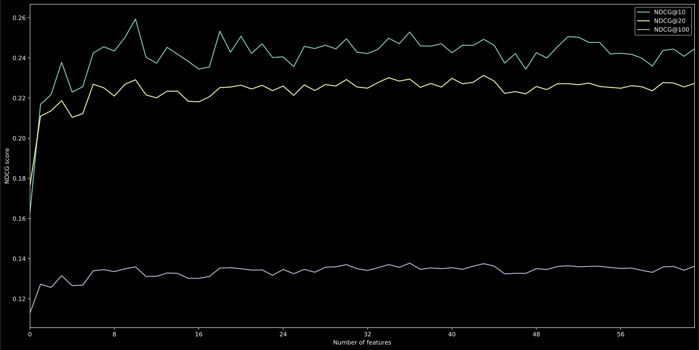

# Report on Assignment 2B

**Team ID:** 009

**Student Name(s):** Téo Bouvard

## Feature development (max. 500 words, excluding table and list)

Briefly list *all* the features implemented in your code, one feature per bullet point. If the implementation of a feature was not trivial, briefly (max. 50 words per item) describe the implementation. Use short, distinctive, and informative names for the additional features, e.g., not FeatureX but rather PageRank.
We distinguish between 3 feature groups:
    - [QD] Query-document features
    - [Q] Query features
    - [D] Document features

* Features
    * Query-document features
        * BM25 on 'title' field
        * BM25 on 'content' field
        * BM25 on 'anchors' field
        * LM on 'title' field
        * LM on 'content' field
        * LM on 'anchors' field
        * sum TF on 'title' field : sum of TF over all query terms
        * sum TF on 'content' field
        * sum TF on 'anchors' field
        * mean TF on 'title' field : mean of TF over all query terms
        * mean TF on 'content' field
        * mean TF on 'anchors' field
        * min TF on 'title' field : min of TF over all query terms
        * min TF on 'content' field
        * min TF on 'anchors' field
        * max TF on 'title' field : max of TF over all query terms
        * max TF on 'content' field
        * max TF on 'anchors' field
        * normalized sum TF on 'title' field : sum TF divided by number of terms in the query
        * normalized sum TF on 'content' field
        * normalized sum TF on 'anchors' field
        * normalized mean TF on 'title' field
        * normalized mean TF on 'content' field
        * normalized mean TF on 'anchors' field
        * normalized min TF on 'title' field
        * normalized min TF on 'content' field
        * normalized min TF on 'anchors' field
        * normalized max TF on 'title' field
        * normalized max TF on 'content' field
        * normalized max TF on 'anchors' field
        * sum TFIDF on 'title' field
        * sum TFIDF on 'content' field
        * sum TFIDF on 'anchors' field
        * mean TFIDF on 'title' field
        * mean TFIDF on 'content' field
        * mean TFIDF on 'anchors' field
        * min TFIDF on 'title' field
        * min TFIDF on 'content' field
        * min TFIDF on 'anchors' field
        * max TFIDF on 'title' field
        * max TFIDF on 'content' field
        * max TFIDF on 'anchors' field
        * normalized sum TFIDF on 'title' field
        * normalized sum TFIDF on 'content' field
        * normalized sum TFIDF on 'anchors' field
        * normalized mean TFIDF on 'title' field
        * normalized mean TFIDF on 'content' field
        * normalized mean TFIDF on 'anchors' field
        * normalized min TFIDF on 'title' field
        * normalized min TFIDF on 'content' field
        * normalized min TFIDF on 'anchors' field
        * normalized max TFIDF on 'title' field
        * normalized max TFIDF on 'content' field
        * normalized max TFIDF on 'anchors' field
        * query coverage on 'title' field : how many query terms are in this field
        * query coverage on 'content' field
        * query coverage on 'anchors' field
        * normalized query coverage on 'title' field : query coverage divided by number of terms in the query
        * normalized query coverage on 'content' field
        * normalized query coverage on 'anchors' field
    * Query features
        * Query length
    * Document features
        * Length of 'title' field
        * Length of 'content' field
        * Length of 'anchors' field
        * PageRank score

Describe your rationale behind your choice of additional features. Why would you expect these to be helpful in identifying the most relevant documents to a query?

I expected the variations of TF and TFIDF (sum, mean, min, max) to be helpful because they represent in *different ways* how well a document is relevant to a given query.
For example, I find the 'min TF' feature and its TFIDF counterpart interesting, as it measures how well documents match the least represented term in the query. I think that allows to better rerank documents on vague queries which have only one specific term among non-determining terms. In the query 'where to find morel mushrooms' for example, 'where', 'find' and 'mushrooms' may retrieve a lot of low-relevance documents in first-pass retrieval. But identifying the documents in this first pass which mentions 'morel' the most seems to be a great feature in Learning to Rank. 
Query coverage features are based on the same idea, but do not rely on the term frequency in documents, only on identifying what percentage of the query terms is covered in a document. That is, if a document from first-pass retieval has a great BM25 score because it mentions 'find' and 'mushrooms' a lot but never mentions 'morel', this should be identified.

### Learning algorithm
* Choose one learning-to-rank algorithm for the entire assignment, explain why this one was chosen, and state how the hyperparameters were set.

To predict relevance labels from features, we use meta-estimators to maximize the strength of our model. This allows us to build a strong model without having to tune the hyperparameters by grid search or randomized search. Furthermore, it allows us to identify the most important features directly by checking the model's attributes. After checking the inital cross-validation NDCG scores of `AdaBoostRegressor`, `BaggingRegressor`, `GradientBoostingRegressor` and `RandomForestRegressor` from sklearn's library, we decide to use `GradientBoostingRegressor`, with its default least squares loss function.

### Results

* Complete the table below with learning-to-rank results on `data/queries.txt`.
  - These numbers should be obtained using 5-fold cross-validation on the provided queries and relevance judgments.
  - Report on four combinations of feature groups: QD, QD+Q, QD+D, QD+Q+D
  - Use the same training/test folds to make sure the numbers are comparable!

| **Features** | **Output file** | **NDCG@10** | **NDCG@20** |
| -- | -- | -- | -- |
| Baseline | ranking_bm25.csv | 0.1657 | 0.1534 |
| Only QD features | ranking_QD.csv | 0.2462 | 0.2284 |
| QD + Q features | ranking_QD_Q.csv | 0.2426 | 0.2241 |
| QD + D features | ranking_QD_D.csv |0.2382 | 0.2244 |
| ALL features (QD + Q + D) | ranking_all_features.csv | 0.2418 | 0.2268 |

## Feature selection experiments (max. 400 words, excluding table)

The five features carrying the most influence over the relevance prediction are : 

* BM25 on 'content' field
* BM25 on 'title' field
* LM on 'content' field
* normalized mean TF on 'content' field
* normalized max TFIDF on 'content' field

These features were found by sorting the values of the `feature_importances_` attribute of our regressor, and picking the first 5. A bar plot of all feature importances can be found below.

### Results

* Complete the table below with learning-to-rank results on `data/queries2.txt`, filling in just the two rows: 
    * the full feature set and 
	* the selected feature set of the five best features.

| **Features** | **Output file** | **NDCG@100** |
| -- | -- | -- | -- |
| ALL features (QD + Q + D) | ranking_all_features.csv | 0.0472 |
| Selected five best features | ranking_top5.csv | 0.4722 |

## Kaggle submission (max. 300 words)

* Having made some submissions to Kaggle, list the feature set you used to get the best performance. 
* Describe the process of arriving at this feature set. 
* Include your reasoning behind each of the different steps or stages described. 
* If you needed to update the hyperparameters during these steps, describe the changes and your reasoning behind each update.

I don't have the exact setting that went into the best Kaggle performance. It was one of my first submissions and the score was quite bad so I did not record the selected features. However, the strategy used to find an optimal set of features was to train models on consecutive subsets of the most important features, compute their NDCG scores with cross-validation, and use the model with the highest score to predict the test queries. What I identified was that the NDCG score became stable after adding only 7 or 8 features, and that the rest of the features did not really influence the score outcome. However, this did not allow me to improve my best score on Kaggle, once again probably because I was overfitting on the training set. The submodels scores are presented in the plot below.

## Challenges

Despite all the efforts, I could not manage to get a better NDCG score than the first-pass retrieval. Below are some of the additional strategies I tried in order to improve the performance of my model.

* Class balancing

| **Relevance Label** | **Number of training instances** |
|-- | -- |
|-2|8|
|0|843|
|1|331|
|2|89|
|3|11|

Our training set is heavily unbalanced. Nearly 90% of the set has the same target value, so it is really hard to fit a meaningful model to this training data. In the ranking part, I tried to upsample the minority classes (relevances -2, 1, 2, 3) to reinforce their signal. This resulted in a great improvement of NDCG scores in cross-validation but a loss of performance on the test set, which is probably due to overfitting.
On a side note, none of the documents having a relevance of 4 were in the index, and only 11 had a relevance of 3. This means that our model could not really identify important features on the most relevant documents. 

* Feature normalization

Feature values may vary greatly among queries, depending on the query length or the popularity of query terms in the collection. Some documents have high TF scores because the query terms are repeated a lot in the retrieved documents, but that doesn't necessarily mean the features associated with these documents lead to a high relevance on other queries. To smooth this effect, I tried normalizing the feature vectors both on the whole dataset and on a per-query basis, but that did not lead to a significant gain in performance.

* Missing features

I think some features such as fraction of stopwords could have been useful but were not implemented given the structure and delays of the assignment.

## References

* Xinzhi Han: “Feature Selection and Model Comparison on Microsoft Learning-to-Rank Data Sets”, 2018; [http://arxiv.org/abs/1803.05127 arXiv:1803.05127].

* Tao Qin: “Introducing LETOR 4.0 Datasets”, 2013; [http://arxiv.org/abs/1306.2597 arXiv:1306.2597].