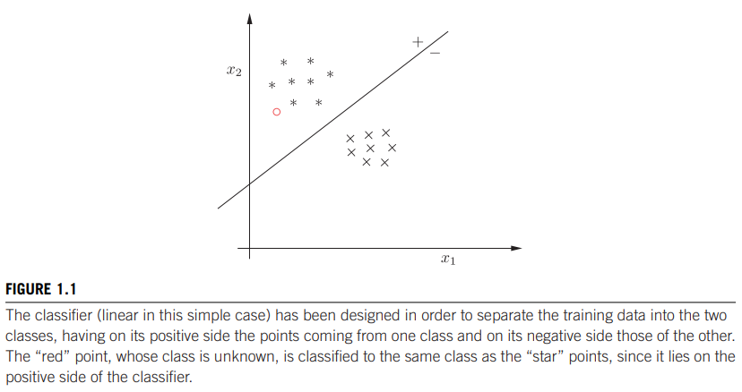

## What ML is about

The focus is on learning from data by exploiting model structures and patterns that can be used to make predictions on future generations of data from the same underlying process. Many disciplines focusing on these matters : statistical learning, pattern recognition, signal and image processing, computer science, data mining ...

## Classification

The case of discriminating salmon from sea bass is an exercise of classification problems.

## Regression

Continuous version of classification.

## Formalizing the introductory problem

class 1 : sea bass (w1)
class 2 : salmon (w2)

Aim is to discriminate between objects of the two classes with the minimum error rate.

P(w1) = prior probability that the observed fish is a sea bass
P(w2) = prior probability that the observed fish is a salmon

Only knowing prior probabilities (without observation), the optimal decision rule would be to classify samples as the largest prior probability, ie. choosing w1 if P(w1) > P(w2) else w2 leading to an error of w2.

If we use information derived through observation (measurements, feature extraction, characterization, ...) quantified in a continuous random variable we call a feature vector x.

Our knowledge of the distribution of x for each category is expressed by the class specific density function p(x|wi) for i = 1, 2. 

IMAGE

The observaion change our certainty about which category the object belongs to. The certainty prior to observation is changed to a certainty influenced by the observation.

prior probability --> posteror probability

## Bayes rule

* p( w1 | x ) = (p( x | w1 ) * p( w1)) / p( x )

* p( x ) = p( w1 ) * p( x | w1 ) + p( w2 ) * p( x | w2 )

An observation of x with p( w1 | x ) > p( w2 | x ) will lead us to decide on w1 as it has the highest posterior probability.

Proof : The error rate for an observed x will correspond to the probabilities of the category not chosen.

p( error | x ) = p( w1 | x ) if we decide w2 else p( w2 | x).

For a given x, we can minimize th error rate by selecting the class with the higher posterior probability.

## Lecture 2

The general case :

Feature vectors combining several features -> high dimensinality is possible. 
* X = (x1 ... xl)
* M states of natures (classes)
* omega = {w1, ..., wM}
* prior probabilities P(wi) i = 1, ..., M
* class specific desity functions P(x|wi)

Bayes rule : P(wi|x) = ( P(wi) * P(x|wi) ) / P(x)
with P(x) = sum(j=1->M) of P(wj) * P(x|wi)

Some misclassifications might be considered worse than others. We introduce loss functions to compensate for this. We want to minimize the risk associated to the decisions we are making.

* loss functions : lambda(alphai|wj) shorthand : lambdaij  
alphai denotes taking actions alphai (typically deciding wi, while an optional alphai+1 might be corresponding to making no decision).
"taking action i when j is the true state of nature"

So when decisions corresponds to alphai, we have to consider all possible states of nature which all can be true. We do this using the conditional risk function.

* R(alphai|x) = sum(j=1 to M) lambdaij * P(wj | x)

We want a decision rule which minimizes the average (or expected) risk (loss). (see notes)
Minimum error rate classificatins as a special case of minimum risk classification. We use symmetrical loss functions (0 if right decision, 1 otherwise)