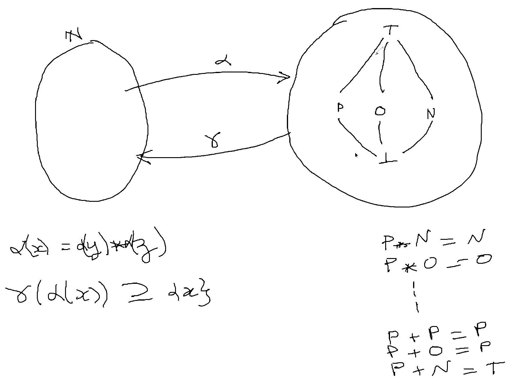

## Complexity classes

- P -> polynomial complexity
- NP -> polynomial complexity on non-deterministic Turing machines
- NP-complete -> hardest problems of NP
- NP-intermediate -> in NP but neither NP-complete nor P
- NP-hard -> harder than NP, non polynomial certificates (PSPACE, EXPTIME, EXPSPACE)

NP-complete proof :

- Certificates of NP
- Reduction from known NP to X

FPT : fixed parameter tractability
Small changes in preconditions can change drastically change problem complexity
General problems are harder

Graphes planaires -> existence d'un algorithme polynomial pour l'isomorphisme

## Decidability and (in)completeness

Formal system (axiom set + inference rules) :

- consistency (cohérent)
- decidability : there exists an algo which answers the question within a finite number of instructions
- completeness (termination ?)

Godel : a formal system cannot demonstrate **its own** consistency

Turing machine but other tools with same expressibility

## Abtractions

Attaques en cryptographie -> concrétisation d'abstractions
Choix d'abstractions effectives suffisamment grossières pour être calculables et mais assez précises pour éviter les fausses alarmes permet de vaincre l'indécidabilité
